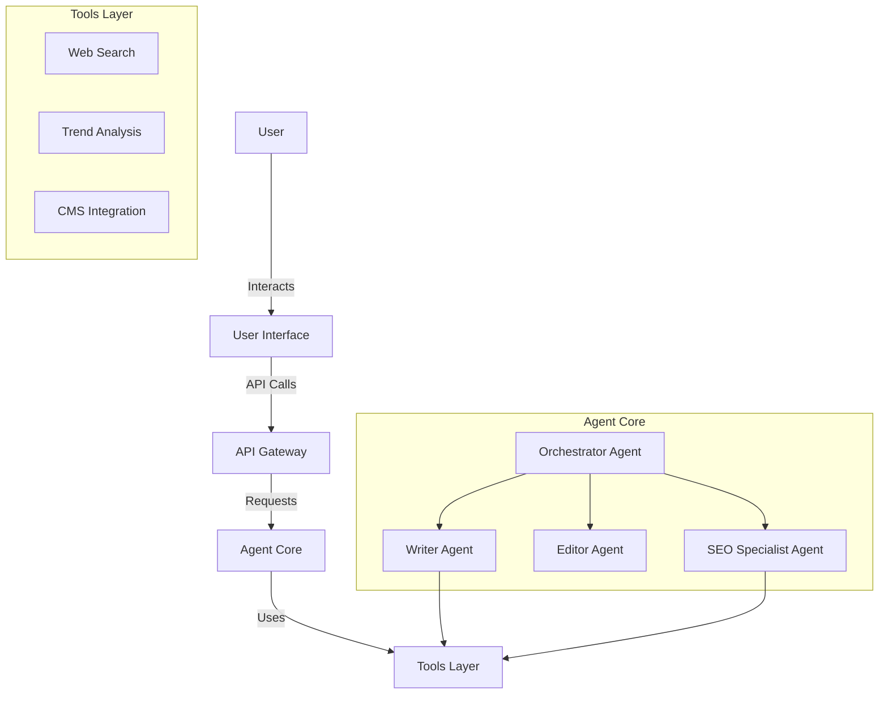

# System Architecture

## High-Level Overview
The Blog Writing Agent is composed of a modular architecture that separates the user interface, the core agent logic, and the external tools/services.

## Components

### 1. User Interface (UI)
- **Web Dashboard**: A clean, responsive web application for users to input topics, review drafts, and configure settings.
- **Chat Interface**: A conversational interface for iterative refinement of content.

### 2. Agent Core
The brain of the system, consisting of specialized sub-agents:
- **Orchestrator**: Manages the workflow, delegates tasks to other agents, and ensures the final output meets requirements.
- **Writer**: Generates the actual content based on outlines and research.
- **Editor**: Reviews content for grammar, style, tone, and coherence.
- **SEO Specialist**: Analyzes content for keyword density, readability, and SEO best practices.

### 3. Tools Layer
- **Web Search**: For gathering real-time information and fact-checking.
- **Trend Analysis**: To identify popular topics and keywords.
- **CMS Integration**: Connectors to publish directly to platforms like WordPress, Medium, or Ghost.

## Data Flow
1.  **Input**: User provides a topic or keyword via the UI.
2.  **Research**: Orchestrator triggers SEO agent to research keywords and trends.
3.  **Outline**: Writer agent creates an outline based on research.
4.  **Drafting**: Writer agent generates the full blog post.
5.  **Review**: Editor agent refines the draft.
6.  **Optimization**: SEO agent performs a final check.
7.  **Output**: Final content is presented to the user for approval or direct publishing.
