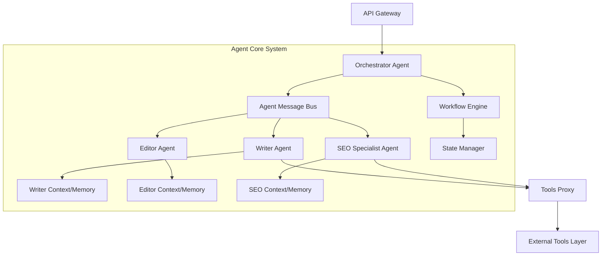
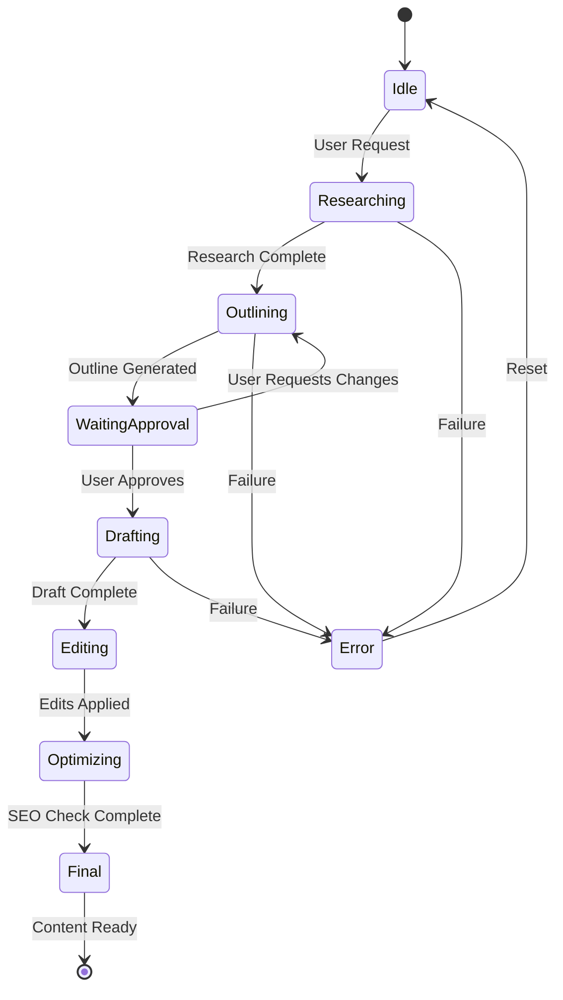

# Component 2: Agent Core - Implementation Design

## Overview
This document outlines the implementation design for the Agent Core component of the Blog Writing Agent. As the Solution Architect, I've designed a multi-agent system that orchestrates specialized sub-agents to deliver high-quality blog content efficiently.

## Architecture Philosophy

The Agent Core follows a **hierarchical multi-agent pattern** where:
- An **Orchestrator** manages the overall workflow
- **Specialized agents** (Writer, Editor, SEO) handle specific tasks
- Agents communicate through a **message bus** for loose coupling
- Each agent maintains its own **context and memory**

## High-Level Architecture



## Core Components

### 1. Orchestrator Agent

**Responsibility**: Central coordinator that manages the entire blog generation workflow.

**Key Functions**:
- **Workflow Management**: Determines which agents to invoke and in what order
- **Task Delegation**: Assigns tasks to specialized agents
- **Quality Assurance**: Ensures final output meets requirements
- **Error Handling**: Manages failures and retries

**State Machine**:


**Implementation Details**:
```python
class OrchestratorAgent:
    def __init__(self):
        self.state_manager = StateManager()
        self.workflow_engine = WorkflowEngine()
        self.message_bus = AgentMessageBus()
        
    async def process_request(self, user_request: UserRequest) -> BlogContent:
        # Initialize workflow
        workflow_id = self.workflow_engine.create_workflow(user_request)
        
        # Execute workflow steps
        while not self.workflow_engine.is_complete(workflow_id):
            current_step = self.workflow_engine.get_current_step(workflow_id)
            
            if current_step == WorkflowStep.RESEARCH:
                await self.delegate_research(workflow_id, user_request)
            elif current_step == WorkflowStep.OUTLINE:
                await self.delegate_outline(workflow_id)
            elif current_step == WorkflowStep.DRAFT:
                await self.delegate_drafting(workflow_id)
            elif current_step == WorkflowStep.EDIT:
                await self.delegate_editing(workflow_id)
            elif current_step == WorkflowStep.OPTIMIZE:
                await self.delegate_optimization(workflow_id)
            
            # Move to next step
            self.workflow_engine.advance(workflow_id)
        
        return self.state_manager.get_final_content(workflow_id)
    
    async def delegate_research(self, workflow_id: str, request: UserRequest):
        message = AgentMessage(
            type=MessageType.RESEARCH_REQUEST,
            payload={"keywords": request.keywords, "tone": request.tone},
            workflow_id=workflow_id
        )
        await self.message_bus.publish("seo.research", message)
        
        # Wait for response
        response = await self.message_bus.wait_for_response(workflow_id, "research")
        self.state_manager.store_research(workflow_id, response.data)
```

### 2. Writer Agent

**Responsibility**: Generates content (outlines and full drafts) based on research and requirements.

**Key Functions**:
- **Outline Creation**: Structures the blog post with sections and subsections
- **Content Generation**: Writes engaging, informative content
- **Research Integration**: Incorporates findings from SEO research
- **Tone Adaptation**: Adjusts writing style based on specified tone

**Prompting Strategy**:
```python
class WriterAgent:
    def __init__(self):
        self.llm_client = LLMClient()
        self.context_manager = ContextManager()
        self.template_library = TemplateLibrary()
        
    async def create_outline(self, topic: str, research_data: ResearchData, tone: str) -> Outline:
        # Build context
        context = self.context_manager.build_context({
            "topic": topic,
            "keywords": research_data.keywords,
            "competitor_insights": research_data.competitor_analysis,
            "tone": tone
        })
        
        # Select appropriate template
        template = self.template_library.get_outline_template(tone)
        
        # Generate outline using LLM
        prompt = template.format(
            topic=topic,
            keywords=", ".join(research_data.keywords),
            structure_guidance=self._get_structure_guidance(topic),
            tone_guidance=self._get_tone_guidance(tone)
        )
        
        response = await self.llm_client.generate(
            prompt=prompt,
            system_prompt=WRITER_SYSTEM_PROMPT,
            temperature=0.7,
            max_tokens=1000
        )
        
        return self._parse_outline(response.text)
    
    async def generate_draft(self, outline: Outline, research_data: ResearchData) -> str:
        sections = []
        
        for section in outline.sections:
            section_prompt = self._build_section_prompt(section, research_data)
            
            section_content = await self.llm_client.generate(
                prompt=section_prompt,
                system_prompt=WRITER_SYSTEM_PROMPT,
                temperature=0.8,  # Higher creativity for content
                max_tokens=500
            )
            
            sections.append(section_content.text)
        
        # Combine sections with transitions
        full_draft = self._combine_with_transitions(sections, outline)
        return full_draft
```

**System Prompt Template**:
```
You are an expert blog writer specializing in {tone} content. Your writing is:
- Engaging and reader-focused
- Well-structured with clear flow
- Informative and accurate
- Optimized for readability

When creating content:
1. Start with a compelling hook
2. Use clear, concise language
3. Incorporate relevant examples
4. Maintain consistent tone throughout
5. End with actionable takeaways
```

### 3. Editor Agent

**Responsibility**: Reviews and refines content for quality, clarity, and coherence.

**Key Functions**:
- **Grammar & Spelling Check**: Identifies and corrects errors
- **Style Consistency**: Ensures uniform tone and voice
- **Readability Analysis**: Assesses and improves clarity
- **Fact Verification**: Checks for accuracy (basic level)

**Implementation**:
```python
class EditorAgent:
    def __init__(self):
        self.llm_client = LLMClient()
        self.grammar_checker = GrammarChecker()  # Integration with LanguageTool or similar
        self.readability_analyzer = ReadabilityAnalyzer()
        
    async def edit_content(self, draft: str, tone: str, requirements: EditRequirements) -> EditedContent:
        # Step 1: Grammar and spelling check
        grammar_corrections = self.grammar_checker.check(draft)
        draft_corrected = self.grammar_checker.apply_corrections(draft, grammar_corrections)
        
        # Step 2: Readability analysis
        readability_score = self.readability_analyzer.analyze(draft_corrected)
        
        # Step 3: AI-powered refinement
        if readability_score < requirements.min_readability_score:
            draft_corrected = await self._improve_readability(draft_corrected, tone)
        
        # Step 4: Tone consistency check
        tone_issues = await self._check_tone_consistency(draft_corrected, tone)
        if tone_issues:
            draft_corrected = await self._fix_tone_issues(draft_corrected, tone, tone_issues)
        
        return EditedContent(
            content=draft_corrected,
            corrections=grammar_corrections,
            readability_score=readability_score,
            changes_summary=self._summarize_changes(draft, draft_corrected)
        )
    
    async def _improve_readability(self, text: str, tone: str) -> str:
        prompt = f"""
        Improve the readability of the following text while maintaining the {tone} tone.
        Focus on:
        - Shorter sentences where appropriate
        - Active voice instead of passive
        - Simpler vocabulary without losing meaning
        - Better paragraph structure
        
        Text:
        {text}
        
        Provide only the improved version without explanations.
        """
        
        response = await self.llm_client.generate(
            prompt=prompt,
            system_prompt=EDITOR_SYSTEM_PROMPT,
            temperature=0.5  # Lower temperature for consistency
        )
        
        return response.text
```

### 4. SEO Specialist Agent

**Responsibility**: Optimizes content for search engines and provides keyword research.

**Key Functions**:
- **Keyword Research**: Identifies relevant keywords and search trends
- **SEO Analysis**: Evaluates keyword usage, density, and placement
- **Meta Generation**: Creates optimized meta titles and descriptions
- **Readability Check**: Ensures content meets SEO readability standards

**Implementation**:
```python
class SEOSpecialistAgent:
    def __init__(self):
        self.search_tool = WebSearchTool()
        self.trend_analyzer = TrendAnalysisTool()
        self.llm_client = LLMClient()
        
    async def research_keywords(self, topic: str) -> ResearchData:
        # Get trending keywords
        trends = await self.trend_analyzer.get_trends(topic)
        
        # Search for related content
        search_results = await self.search_tool.search(topic, limit=10)
        
        # Analyze competitor content
        competitor_keywords = self._extract_keywords_from_competitors(search_results)
        
        # Generate keyword suggestions using LLM
        keyword_prompt = f"""
        Based on the topic "{topic}" and the following trending terms: {trends},
        suggest 10-15 relevant keywords that should be included in a blog post.
        Prioritize keywords with good search volume and relevance.
        
        Format: Return as a JSON array of keyword objects with "term" and "priority" fields.
        """
        
        response = await self.llm_client.generate(
            prompt=keyword_prompt,
            system_prompt=SEO_SYSTEM_PROMPT,
            temperature=0.3
        )
        
        keywords = self._parse_keywords(response.text)
        
        return ResearchData(
            keywords=keywords,
            trends=trends,
            competitor_analysis=competitor_keywords
        )
    
    async def analyze_seo(self, content: str, target_keywords: List[str]) -> SEOAnalysis:
        # Keyword density analysis
        keyword_usage = self._analyze_keyword_usage(content, target_keywords)
        
        # Readability (Flesch-Kincaid)
        readability = self._calculate_readability(content)
        
        # Structure analysis
        structure_score = self._analyze_structure(content)
        
        # Calculate overall SEO score
        seo_score = self._calculate_seo_score(keyword_usage, readability, structure_score)
        
        return SEOAnalysis(
            score=seo_score,
            keyword_usage=keyword_usage,
            readability_score=readability,
            structure_score=structure_score,
            recommendations=self._generate_recommendations(keyword_usage, readability, structure_score)
        )
    
    async def generate_meta_tags(self, content: str, keywords: List[str]) -> MetaTags:
        prompt = f"""
        Generate an SEO-optimized meta title and meta description for a blog post about {keywords[0]}.
        
        Content summary: {content[:500]}...
        
        Requirements:
        - Meta title: 50-60 characters, includes primary keyword
        - Meta description: 150-160 characters, compelling and includes 2-3 keywords
        
        Return as JSON with "title" and "description" fields.
        """
        
        response = await self.llm_client.generate(
            prompt=prompt,
            system_prompt=SEO_SYSTEM_PROMPT,
            temperature=0.4
        )
        
        return self._parse_meta_tags(response.text)
```

## Inter-Agent Communication

### Message Bus Architecture
```python
class AgentMessageBus:
    def __init__(self):
        self.subscribers: Dict[str, List[Callable]] = {}
        self.pending_responses: Dict[str, asyncio.Future] = {}
        
    async def publish(self, channel: str, message: AgentMessage):
        if channel in self.subscribers:
            for handler in self.subscribers[channel]:
                asyncio.create_task(handler(message))
    
    def subscribe(self, channel: str, handler: Callable):
        if channel not in self.subscribers:
            self.subscribers[channel] = []
        self.subscribers[channel].append(handler)
    
    async def wait_for_response(self, workflow_id: str, response_type: str, timeout: int = 60) -> AgentMessage:
        key = f"{workflow_id}:{response_type}"
        future = asyncio.Future()
        self.pending_responses[key] = future
        
        try:
            return await asyncio.wait_for(future, timeout=timeout)
        except asyncio.TimeoutError:
            raise TimeoutError(f"No response received for {response_type}")
```

### Message Schema
```python
@dataclass
class AgentMessage:
    type: MessageType
    workflow_id: str
    sender: str
    payload: Dict[str, Any]
    timestamp: datetime
    correlation_id: Optional[str] = None
```

## State Management

### Workflow State
```python
class StateManager:
    def __init__(self):
        self.storage = RedisStorage()  # or in-memory for development
        
    def store_research(self, workflow_id: str, research: ResearchData):
        key = f"workflow:{workflow_id}:research"
        self.storage.set(key, research.to_json())
    
    def get_research(self, workflow_id: str) -> ResearchData:
        key = f"workflow:{workflow_id}:research"
        data = self.storage.get(key)
        return ResearchData.from_json(data)
    
    def store_outline(self, workflow_id: str, outline: Outline):
        key = f"workflow:{workflow_id}:outline"
        self.storage.set(key, outline.to_json())
    
    # Similar methods for draft, edits, final content, etc.
```

## Error Handling & Resilience

### Retry Strategy
```python
class WorkflowEngine:
    async def execute_step_with_retry(self, step: WorkflowStep, max_retries: int = 3):
        for attempt in range(max_retries):
            try:
                result = await self._execute_step(step)
                return result
            except TransientError as e:
                if attempt < max_retries - 1:
                    await asyncio.sleep(2 ** attempt)  # Exponential backoff
                    continue
                else:
                    raise
            except PermanentError as e:
                # Don't retry permanent errors
                raise
```

### Fallback Mechanisms
- **LLM Fallback**: If primary LLM fails, switch to backup model
- **Partial Success**: Save intermediate results to allow resumption
- **Graceful Degradation**: Reduce quality requirements if constraints can't be met

## Performance Optimization

### Caching
- **Research Cache**: Cache keyword research for topics (TTL: 24 hours)
- **Template Cache**: In-memory cache for prompt templates
- **LLM Response Cache**: Cache similar requests (hash-based)

### Parallel Processing
```python
async def generate_draft_parallel(self, outline: Outline) -> str:
    # Generate all sections in parallel
    tasks = [
        self.generate_section(section)
        for section in outline.sections
    ]
    
    sections = await asyncio.gather(*tasks)
    return self._combine_sections(sections, outline)
```

## Monitoring & Observability

### Metrics to Track
- **Workflow Duration**: Time from request to completion
- **Agent Response Time**: Individual agent performance
- **LLM Token Usage**: Cost tracking
- **Error Rates**: By agent and error type
- **Cache Hit Rate**: Effectiveness of caching

### Logging
```python
import structlog

logger = structlog.get_logger()

class OrchestratorAgent:
    async def process_request(self, user_request: UserRequest):
        logger.info("workflow_started", 
                   workflow_id=workflow_id, 
                   topic=user_request.topic)
        
        # ... processing ...
        
        logger. info("workflow_completed",
                    workflow_id=workflow_id,
                    duration_seconds=duration)
```

## Testing Strategy

### Unit Tests
- Individual agent logic
- Message bus functionality
- State management operations

### Integration Tests
- Multi-agent workflows
- Error handling and retries
- State persistence

### Contract Tests
- Agent interface contracts
- Message schema validation
- API compatibility

## Deployment Considerations

### Scalability
- **Horizontal Scaling**: Run multiple instances of each agent type
- **Load Balancing**: Distribute requests across agent instances
- **Queue-Based**: Use message queues (RabbitMQ, Kafka) for agent communication in production

### Configuration
```yaml
agents:
  orchestrator:
    instances: 2
    max_concurrent_workflows: 10
  
  writer:
    instances: 3
    llm_model: "gpt-4"
    temperature: 0.7
  
  editor:
    instances: 2
    llm_model: "gpt-4"
    grammar_tool: "languagetool"
  
  seo:
    instances: 2
    search_api: "serp_api"
    trend_source: "google_trends"
```

## Future Enhancements

1. **Learning & Adaptation**: Collect user feedback to fine-tune agent prompts
2. **Custom Agent Templates**: Allow users to create custom agent behaviors
3. **Multi-Language Support**: Extend agents to support content in multiple languages
4. **A/B Testing**: Test different prompting strategies and select best performers
5. **Human-in-the-Loop**: Optional manual review checkpoints in workflow
