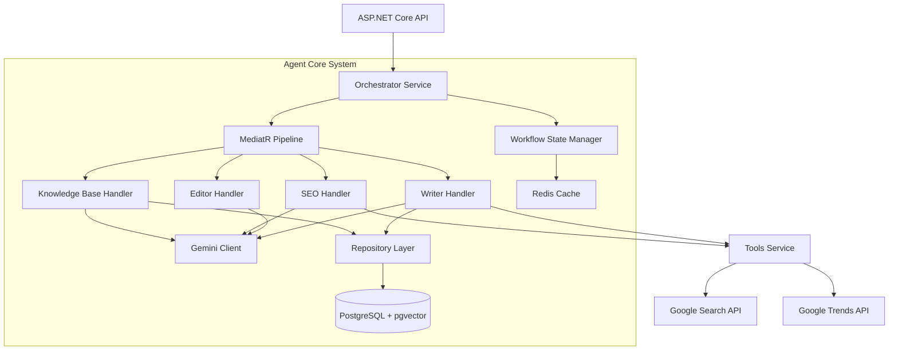
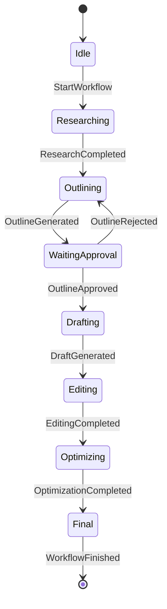

# Component 2: Agent Core - Implementation Design

## Overview

This document outlines the implementation design for the Agent Core component of the Blog Writing Agent. As the Technical Architect, I've designed a robust, scalable system using **C# and ASP.NET Core**, leveraging **Google Gemini** for advanced AI capabilities.

## Architecture Philosophy

The Agent Core follows a **Modular Monolith** architecture (transitioning to Microservices if needed) where:

- **ASP.NET Core Web API** serves as the entry point.
- **Semantic Kernel** or custom **Gemini Client** is used for AI orchestration.
- **Background Services** (Hosted Services) manage long-running workflows.
- **MediatR** handles in-process messaging and decoupling.

## High-Level Architecture



## API Contract (Workflow-Centric)

The Agent Core exposes the following REST endpoints to drive the workflow. These endpoints map directly to MediatR commands.

| Endpoint | Method | Command | Description |
| :--- | :--- | :--- | :--- |
| `/api/workflows` | POST | `StartWorkflowCommand` | Initiates a new blog generation workflow. |
| `/api/workflows/{id}` | GET | `GetWorkflowQuery` | Retrieves the current state and data of a workflow. |
| `/api/workflows/{id}/approve-outline` | POST | `ApproveOutlineCommand` | Transitions from `WaitingApproval` to `Drafting`. |
| `/api/workflows/{id}/reject-outline` | POST | `RejectOutlineCommand` | Transitions from `WaitingApproval` to `Outlining` (retry). |
| `/api/workflows/{id}/revise` | POST | `ReviseDraftCommand` | Requests revisions on the current draft. |
| `/api/workflows/{id}/chat` | POST | `ChatCommand` | Processes a chat message within the workflow context. |

## Core Components

### 1. Orchestrator Service

**Responsibility**: Manages the blog generation lifecycle using a state machine pattern.

**Key Functions**:

- **Workflow Coordination**: Transitions between states (Research -> Outline -> Draft -> Edit).
- **State Persistence**: Saves workflow progress to Redis/SQL.
- **Error Handling**: Implements Polly policies for retries and circuit breaking.

**State Machine**:



**Implementation Details (C#)**:

```csharp
public class OrchestratorService : IOrchestratorService
{
    private readonly IMediator _mediator;
    private readonly IWorkflowRepository _repository;

    public OrchestratorService(IMediator mediator, IWorkflowRepository repository)
    {
        _mediator = mediator;
        _repository = repository;
    }

    public async Task ProcessWorkflowAsync(Guid workflowId)
    {
        var workflow = await _repository.GetAsync(workflowId);
        
        switch (workflow.State)
        {
            case WorkflowState.Researching:
                var researchResult = await _mediator.Send(new ResearchCommand(workflow.Topic));
                workflow.UpdateResearch(researchResult);
                workflow.TransitionTo(WorkflowState.Outlining);
                break;
                
            case WorkflowState.Outlining:
                var outline = await _mediator.Send(new GenerateOutlineCommand(workflow.Topic, workflow.ResearchData));
                workflow.SetOutline(outline);
                workflow.TransitionTo(WorkflowState.WaitingApproval);
                break;
                
            // ... handle other states
        }
        
        await _repository.SaveAsync(workflow);
    }
}
```

### 2. Writer Agent (Handler)

**Responsibility**: Generates content using Gemini Pro.

**Key Functions**:

- **Outline Generation**: Creates structured outlines.
- **Drafting**: Generates full blog posts based on outlines.
- **Context Management**: Builds prompts with research data and tone.

**Implementation (C#)**:

```csharp
public class WriterHandler : IRequestHandler<GenerateDraftCommand, string>
{
    private readonly IGeminiClient _geminiClient;

    public WriterHandler(IGeminiClient geminiClient)
    {
        _geminiClient = geminiClient;
    }

    public async Task<string> Handle(GenerateDraftCommand request, CancellationToken cancellationToken)
    {
        var prompt = PromptBuilder.Create()
            .WithSystemPrompt($"You are an expert blog writer with a {request.Tone} tone.")
            .WithContext("Topic", request.Topic)
            .WithContext("Outline", request.Outline)
            .WithContext("Keywords", string.Join(", ", request.Keywords))
            .Build();

        var response = await _geminiClient.GenerateContentAsync(prompt);
        return response.Text;
    }
}
```

### 3. Editor Agent (Handler)

**Responsibility**: Refines content for grammar, style, and clarity.

**Key Functions**:

- **Grammar Check**: Uses Gemini to identify and fix errors.
- **Tone Analysis**: Ensures consistency with the requested tone.
- **Readability Improvement**: Rewrites complex sentences.

**Implementation (C#)**:

```csharp
public class EditorHandler : IRequestHandler<EditContentCommand, EditedContent>
{
    private readonly IGeminiClient _geminiClient;

    public async Task<EditedContent> Handle(EditContentCommand request, CancellationToken cancellationToken)
    {
        var prompt = $@"
            Review the following blog post for grammar, clarity, and tone consistency ({request.TargetTone}).
            Provide the edited version and a list of major changes.
            
            Content:
            {request.DraftContent}
        ";

        var response = await _geminiClient.GenerateContentAsync(prompt);
        return ParseEditorResponse(response.Text);
    }
}
```

### 4. SEO Specialist Agent (Handler)

**Responsibility**: Optimizes content for search engines.

**Key Functions**:

- **Keyword Research**: Integrates with Google Search/Trends APIs.
- **Content Analysis**: Analyzes keyword density and structure.
- **Meta Tag Generation**: Creates title tags and meta descriptions.

**Implementation (C#)**:

```csharp
public class SeoHandler : IRequestHandler<AnalyzeSeoCommand, SeoAnalysisResult>
{
    private readonly IGeminiClient _geminiClient;
    private readonly IGoogleTrendsService _trendsService;

    public async Task<SeoAnalysisResult> Handle(AnalyzeSeoCommand request, CancellationToken cancellationToken)
    {
        // ... implementation
    }
}
```

### 5. Knowledge Base Agent (Handler)

**Responsibility**: Manages vector embeddings and semantic search for blog content.

**Key Functions**:

- **Embedding Generation**: Uses Gemini's embedding model to create vectors for text.
- **Semantic Search**: Queries PostgreSQL using pgvector to find relevant past blogs or context.
- **Storage**: Persists blog posts and their embeddings.

**Implementation (C#)**:

```csharp
public class KnowledgeBaseHandler : IRequestHandler<StoreBlogCommand, bool>, IRequestHandler<SearchSimilarContentCommand, List<BlogContent>>
{
    private readonly IBlogRepository _repository;
    private readonly IGeminiClient _geminiClient;

    public async Task<bool> Handle(StoreBlogCommand request, CancellationToken cancellationToken)
    {
        // 1. Generate embedding
        var embedding = await _geminiClient.GenerateEmbeddingAsync(request.Content);
        
        // 2. Store in DB
        var blog = new BlogEntity 
        { 
            Title = request.Title, 
            Content = request.Content, 
            Embedding = new Vector(embedding) 
        };
        
        await _repository.AddAsync(blog);
        return true;
    }

    public async Task<List<BlogContent>> Handle(SearchSimilarContentCommand request, CancellationToken cancellationToken)
    {
        var queryEmbedding = await _geminiClient.GenerateEmbeddingAsync(request.Query);
        return await _repository.SearchSimilarAsync(queryEmbedding, limit: 5);
    }
}
```

## Database Design

**Technology**: PostgreSQL 16+ with `pgvector` extension.

### Schema

**Blogs Table**:

```sql
CREATE EXTENSION IF NOT EXISTS vector;

CREATE TABLE Blogs (
    Id UUID PRIMARY KEY,
    Title TEXT NOT NULL,
    Content TEXT NOT NULL,
    Author TEXT,
    CreatedAt TIMESTAMP WITH TIME ZONE DEFAULT NOW(),
    Embedding vector(768) -- Dimension depends on Gemini model (e.g., 768 for text-embedding-004)
);

CREATE INDEX ON Blogs USING hnsw (Embedding vector_cosine_ops);
```

**Workflows Table**:

```sql

CREATE TABLE Workflows (
    Id UUID PRIMARY KEY,
    Topic TEXT NOT NULL,
    State TEXT NOT NULL,
    ResearchData TEXT,
    Outline TEXT,
    DraftContent TEXT,
    Tone TEXT,
    Feedback TEXT,
    ChatHistory JSONB,
    CreatedAt TIMESTAMP WITH TIME ZONE DEFAULT NOW(),
    UpdatedAt TIMESTAMP WITH TIME ZONE DEFAULT NOW()
);
```

## Infrastructure & Configuration

### Dependency Injection

```csharp
public static class ServiceCollectionExtensions
{
    public static IServiceCollection AddAgentCore(this IServiceCollection services, IConfiguration config)
    {
        services.AddMediatR(cfg => cfg.RegisterServicesFromAssembly(typeof(OrchestratorService).Assembly));
        
        // EF Core with PostgreSQL and Vector support
        services.AddDbContext<AgentCoreDbContext>(options =>
            options.UseNpgsql(config.GetConnectionString("DefaultConnection"), o => o.UseVector()));

        services.AddHttpClient<IGeminiClient, GeminiClient>(client =>
        {
            client.BaseAddress = new Uri("https://generativelanguage.googleapis.com");
            client.DefaultRequestHeaders.Add("x-goog-api-key", config["Gemini:ApiKey"]);
        });

        services.AddStackExchangeRedisCache(options =>
        {
            options.Configuration = config.GetConnectionString("Redis");
        });

        services.AddScoped<IOrchestratorService, OrchestratorService>();
        services.AddScoped<IWorkflowRepository, WorkflowRepository>();
        // Add BlogRepository when implemented
        // services.AddScoped<IBlogRepository, BlogRepository>();
        
        return services;
    }
}
```

### Configuration (appsettings.json)

```json
{
  "Gemini": {
    "ApiKey": "YOUR_API_KEY",
    "Model": "gemini-pro",
    "EmbeddingModel": "text-embedding-004"
  },
  "ConnectionStrings": {
    "DefaultConnection": "Host=localhost;Database=AgentCoreDb;Username=postgres;Password=password",
    "Redis": "localhost:6379"
  }
}
```

## Error Handling & Resilience

- **Polly**: Use Polly for retrying Gemini API calls (exponential backoff).
- **Dead Letter Queue**: Failed workflows are moved to a DLQ for manual inspection.

```csharp
// Polly Policy Example
var retryPolicy = HttpPolicyExtensions
    .HandleTransientHttpError()
    .WaitAndRetryAsync(3, retryAttempt => TimeSpan.FromSeconds(Math.Pow(2, retryAttempt)));
```

## Deployment

- **Containerization**: Docker support for easy deployment.
- **CI/CD**: GitHub Actions to build and test the .NET solution.

## Future Enhancements

1. **Semantic Kernel Integration**: Adopt Microsoft Semantic Kernel for more advanced agentic patterns.
2. **Vector Database**: Integrate Qdrant or Pinecone for RAG (Retrieval-Augmented Generation) capabilities.
